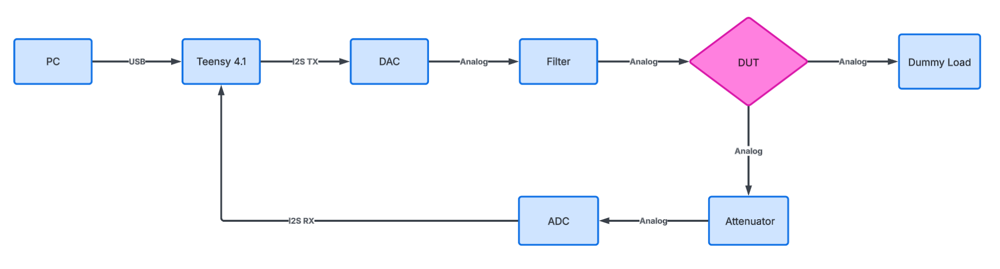

# Audio-Analyser

PC-controlled audio analyzer with integrated dummy load for objective testing and calibration of audio amplifiers.

## Overview

This project provides a complete measurement chain for testing audio amplifiers — measuring key parameters like THD(+N), frequency response, and noise level. It replaces subjective "does it sound right?" evaluations with quantitative, reproducible, and logged results.

Developed as a bachelor project at Ingeniørhøjskolen, Aarhus University.

## Features

- **FFT-based spectrum analysis** with live updating display
- **THD+N measurement** at 1 kHz (and across frequency)
- **Internal loopback** via integrated DAC → ADC signal path
- **Dummy load** switchable between 4 Ω and 8 Ω, rated for ≥ 200 W
- **Over-temperature protection** with automatic relay cutoff (fail-safe)
- **Data logging** to CSV/JSON with date, DUT ID, load mode and sample rate
- **PDF report generation** with test info, results and FFT plots
- **24-bit / 192 kHz** dual-channel synchronous capture

## System Architecture

The signal chain is split into two branches:
- **Generator path**: PC → Teensy → DAC → Filter → DUT
- **Measurement path**: DUT → Attenuator → ADC → Teensy → PC

## Hardware

| Component | Description |
|-----------|-------------|
| Teensy 4.1 | MCU — USB High-Speed (480 Mbit/s), hardware I2S TX/RX |
| TI PCM4222EVM | 24-bit, 2-channel delta-sigma ADC |
| Adafruit PCM5102 | 32-bit I2S DAC, line-level output (~2.1 V RMS), no external control bus needed |
| Dummy Load | 16× 2 Ω/100 W resistors, 2-branch per channel configuration, relay-switched 4 Ω / 8 Ω |

## Repository Structure

Audio-Analyser/
- docs: Documentation, reports, measurements and pictures
- firmware: Teensy 4.1 firmware (PlatformIO / Arduino framework)
- software: PC-side Python application (FFT GUI, logging, reporting)

## Measurement Standards

Audio measurements are referenced against **DS/EN IEC 60268-3:2018** — *Sound system equipment, Part 3: Amplifiers* — used as a technical reference for parameters such as THD(+N), frequency response, and load conditions.

## Author

**Christian Rasmussen** 
